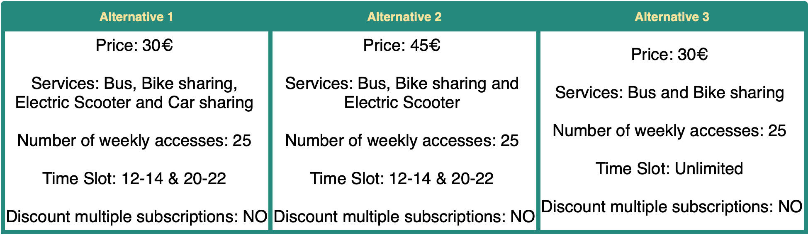

```{r setup, include=FALSE, fig.align='center'}
knitr::opts_chunk$set(echo = TRUE)
```

```{r libraries and functions, include=FALSE, messag=F}
library(support.CEs)
library(tidyverse)
library(mlogit)
library(ggplot2)
library(gridExtra)
library(parallel)
library(lattice)
library(MASS)
library(cowplot)

source("functions.R")
```

## Abstract
Urban mobility has become a crucial aspect in the recent years and this was probably caused by: always more populated cities; the increasing pollution in city centers; the request for flexible means of transport. These arising necessities have not been faced with appropriate solutions by municipals administrations. For this reason, we thought that it could be interesting to collect insights about a possible unique urban mobility subscription, which includes different means of transport and might meet the demand for flexibility as well as greater sustainability. Trying to assess this, we structured a questionnaire to be analyzed using Choice-based Conjoint Analysis. In particular the project is structured as follows: 

* Multinomial Logit Model (MNL);
* Multilevel Multinomial Logit Model (Mixed MNL);
* Willingness-to-Pay and Preference Shares;
* Detection and explanation of possible market niches through the collected individual-level variables.


## Introduction 
This project has the aim of inspecting consumer's preferences about an hypothetical subscription to different public means of transport.    

The idea is to propose to costumers a unique subscription to urban mobility, the alternatives proposed differ for the number of services accessible with the subscription, the number of weekly accesses to the services, the time slots in which the services are accessible and obviously the price. Some alternatives also have a discount for multiple subscriptions.  

* Possible services included: "bus and bike-sharing", "bus, bike-sharing and electric scooter", "bus, bike-sharing, electric scooter and car-sharing"
* Time slots in which the subscription can be used: "8-10 and 17-19", "12-14 and 20-22" and "Unlimited"
* Number of weekly accesses to the various services included: 10, 25, 35
* Prices: 30, 45, 65

The goal of this research is to answer the following questions using Choice-based Conjoint Analysis methods:

1. *When evaluating a subscription to urban mobility, which are the features that consumers value the most?* <br>
2. *How can it can be assessed the preference toward a specific service profile that is about to be launched on the market? How its success can be increased?* <br>
3. *Is it possible to identify a sort of heterogeneity in respondents' preferences towards the choice of the service and can it be explained with the individual-level variables?*

<br>
<center>

{width=65%}

</center> 
<br>

## Building the questionnaire 

The questionnaire has been built using a **Fractional Factorial design**. These designs are capable of producing a subset of alternatives, among the huge number of possible alternatives given by all the combinations of the chosen level attributes, that is orthogonal. Having an orthogonal subset is necessary to avoid under- and over-representation of the features characterizing the alternatives, in other words each level of the attributes must have the same frequency. Fractional Factorial designs produce feasible number of choice questions that still allow analysts to reliably estimate the *part-worths* for the main effects but do not allow the estimation of all interaction effects among the attributes. <br> In particular, the design used was the **Mix and Match** one, a randomized variation of the Rotation design. The resulting choice questions have been divided into 2 different blocks of 9 questions each with 3 alternatives per question, in order to have evaluations on 54 different product profiles without proposing too many questions to a single respondent. Having two different blocks of questions also allowed to reach a more heterogeneous set of respondents, the two resulting questionnaires were in fact distributed through two different networks of people. The obtained sample cannot be considered as representative as, given the available resources, the respondents have not been randomly taken from the entire population of possible costumers. <br>
In the chunk below there is the definition of the chosen attributes and their levels. While here the attribute referred to the services included in the subscription has as levels 2, 3 and 4, in the questionnaires that have been distributed -as it can be seen in the figure above- these levels explicitly reported the names of the included services, in order to avoid confusion as much as possible (i.e. services = 2 corresponds to services = "bus and bike sharing"; services = 3 was represented as services = "bus, bike sharing and electric scooter" and so forth and so on). This conversion was done working on the html code used to produce the tables representing the alternatives.  

```{r Attributes definition, echo=TRUE}
attrib <- list(services. = c("2", "3", "4"), 
               n_accesses. = c("10", "25", "35"),
               time_slot. = c("8-10 & 17-19", "12-14 & 20-22","Unlimited"),
               discount. = c("Yes", "No"),
               price. = c("30","45","65"))
```

Then these attributes have been used to create the Mix and Match design, using the function `rotation.design` from the library `support.CEs`. 

```{r Queastionnaires creation, message = FALSE }
MMSurvey <- rotation.design(attribute.names=attrib, 
                            nalternatives=3, #alternatives per question
                            nblocks=2, #number of blocks 
                            randomize=TRUE, #to specify to use the mix-and-match rather than the rotation design
                            seed=2107) #to specify the random number seed
```

Calling the function `questionnaire()` on the obtained object returns the produced alternatives divided onto two blocks of nine questions with three alternatives each.

## Data Preparation

In the chunk below the dataframe containing the chosen alternatives is created. 
```{r Dataframe creation}
MMSurveyDF <- NULL   #create an empty dataframe
nalt <- MMSurvey$design.information$nalternatives #take the number of alternatives from the generated questionnaire
for(i in seq(1:nalt)) {
  MMSurveyDF <- rbind(MMSurveyDF, MMSurvey$alternatives[[i]])  #fill the dataframe with the chosen alternatives
}
MMSurveyDF <- MMSurveyDF[order(MMSurveyDF$BLOCK, MMSurveyDF$QES),]  #sort the dataframe based on the block and number of question

rownames(MMSurveyDF) <- 1:nrow(MMSurveyDF) #reindex the rownames so that are progressive
head(MMSurveyDF)
```

Below the orthogonality of the levels is checked. 
```{r Orthogonality check}
cor(apply(MMSurveyDF[,-1:-3], 2, rank))        
table(MMSurveyDF$services., MMSurveyDF$n_accesses.)  
table(MMSurveyDF$price., MMSurveyDF$time_slot.) 
```
The questionnaires have been distributed for a couple of weeks via Google Forms. The first block of question received 101 answers and the second one 59, the collected evaluations on product profiles are therefore 4320. 
<br>
Below the collected answers are imported, the column "BLOCK" to distinguish the two different blocks of questions is added and then the dataframes are merged together.<br>
One column containing information about the time of the response is disregarded, other columns are renamed to obtain shorter names and the names of the alternatives are replaced with the corresponding integers. Finally, a progressive number is assigned to each respondent. 

```{r Import answers}
block_1 <- read.csv("data/lcba_1.csv", stringsAsFactors = FALSE)
block_2 <- read.csv("data/lcba_2.csv", stringsAsFactors = FALSE)

block_1$BLOCK <- 1
block_2$BLOCK <- 2

responses <- rbind(block_1, block_2)
responses$Informazioni.cronologiche <- NULL
responses <- responses %>% rename("Q1" = "Question.1",  
                        "Q2" = "Question.2",
                        "Q3" = "Question.3",
                        "Q4" = "Question.4",
                        "Q5" = "Question.5",
                        "Q6" = "Question.6",
                        "Q7" = "Question.7",
                        "Q8" = "Question.8",
                        "Q9" = "Question.9")


responses[responses == "Alternative 1"] <- 1
responses[responses == "Alternative 2"] <- 2
responses[responses == "Alternative 3"] <- 3

responses$ID <- seq.int(nrow(responses))
```

Now it is possible to proceed mapping the obtained responses to the corresponding attributes and levels as defined when building the questionnaire; to do that it can be used the function `make.dataset` from the library `support.CEs`. 
The booleans used to indicate which alternative was picked by the respondent are transformed into integers, the columns of the dataset are reordered, the number of the questions adjusted and the column indicating the choice is renamed. 

```{r Make dataset}

df <- make.dataset(respondent.dataset = responses,
                        choice.indicators = c("Q1", "Q2", "Q3", "Q4", "Q5",
                                              "Q6", "Q7", "Q8", "Q9"),
                        design.matrix = MMSurveyDF)


df$RES[df$RES == TRUE] <- 1
df$RES[df$RES == FALSE] <-0


df <- df[c("ID", "QES", "ALT","services.", "n_accesses.", "time_slot.", "discount.", "price.",  "RES","gender", "age", "Occupation", "Fam_discount")]


df <- df %>% rename("choice" = "RES")
df$QES <- ceiling(as.numeric(rownames(df))/3)  
```

Then the variables of the dataframe are converted into factors and the levels that will be considered as reference ones are chosen. 

```{r Levels definition}

# alternative-specific variables 

df$services. <- factor(df$services., levels = c("2", "3", "4"))
df$n_accesses. <- factor(df$n_accesses., levels= c('10','25','35'))
df$time_slot. <- recode_factor(df$time_slot., "Unlimited" = "Unlimited", "8-10 & 17-19" = "work_use", "12-14 & 20-22" = "leisure_use")
df$time_slot. <- factor(df$time_slot., levels= c('Unlimited','work_use','leisure_use'))

df$discount. <- factor(df$discount., levels = c("Yes", "No"))
df$price. <- as.factor(df$price.)

# individual level variables
df$Occupation <- as.factor(df$Occupation)
df$age <- as.factor(df$age)
df$gender <- as.factor(df$gender)
df$Fam_discount <- as.factor(df$Fam_discount)
```

## Data Exploration

Before starting with the Choice-Based Conjoint Analysis, it is interesting to have look to some statistics about personal features of the respondents. From the below it can be seen that the majority of the respondents is composed by: males, in the age group of 18-27 and they are mainly workers.

```{r Exploration Data Analysis, echo=FALSE, fig.align='center', fig.width=7, fig.height=4}
responses["age_num"] <- as.numeric(as.character(responses$age))
responses["age_group"] = cut(responses$age_num, c("0", "17", "28", "38", "48", "58", "Inf"), c("<=17","18-27", "28-37", "38-47", "48-57", ">=58"))

age <- ggplot(responses, aes(x=factor(age_group)))+
  geom_bar(stat="count", width=0.7, fill="#E7B800", color="black")+
  theme_minimal()+ theme(panel.border = element_blank(), panel.grid.major = element_blank(),
                        panel.grid.minor = element_blank(), axis.line = element_line(colour = "grey80"))+
  labs(x = "Age Group", y=element_blank())

positions <- c("Worker", "Student", "Unemployed")
  occupation <- ggplot(responses, aes(x=factor(Occupation)))+
  geom_bar(stat="count", width=0.7, fill="#E7B800", color="black")+
  theme_minimal()+ theme(panel.border = element_blank(), panel.grid.major = element_blank(),
                        panel.grid.minor = element_blank(), axis.line = element_line(colour = "grey80"))+
  labs(x = "Occupation", y=element_blank())+
  scale_x_discrete(limits = positions)

gender <-  ggplot(responses, aes(x=factor(gender), fill=gender))+
  geom_bar(stat="count", width=0.7, color="black")+
  theme_minimal()+ theme(panel.border = element_blank(), panel.grid.major = element_blank(),
                          panel.grid.minor = element_blank(), axis.line = element_line(colour = "grey80"), legend.position = "none")+
  labs(x = "Gender", y=element_blank())+
  scale_fill_manual(values=c("pink", "blue", "white"))


grid.arrange(age, occupation, gender, nrow=1)
```

To assess whether attributes are properly represented we use `xtabs` which tells us how many times each level of certain attributes has been chosen.
```{r descriptive statistics}
xtabs(choice ~ services., data = df)
xtabs(choice ~ n_accesses., data = df)
xtabs(choice ~ time_slot., data = df)
xtabs(choice ~ discount., data = df)
xtabs(choice ~ price., data = df)
```
As expected, given the choice of fractional factorial design, the attribute distributions are fairly balanced: no attribute is over or under represented.

## Data Analysis 

```{r final dataframe}
str(df)
```

Since the variable `choice` is a qualitative multinomial response variable with three levels, the data will be fitted using the Multinomial Logit Model (MNL) and the mixed MNL model (mixed-MNL). The former assumes there is not consumer heterogeneity, the latter instead deals with it assigning a unique coefficient to each respondent. <br>
Before starting the analysis, the function `dfidx` from the library `mlogit` needs to be called on the obtained dataframe, to properly consider the nested structure of the data. Data collected in this way is in fact characterized by a nested structure: each respondent id nests question numbers and question numbers nests choice alternatives. 

```{r change the format to perform the mlogit}
df.mlogit <- dfidx(df, idx = list(c("QES", "ID"), "ALT"), drop.index = F, levels = c("1", "2", "3"))
```

First it has been fitted a MNL model that includes the intercepts, this is necessary to evaluate if the respondents might have been biased in the choice by the position of the alternative on the questionnaire. This is obviously a non-desirable behavior: given that the questionnaire has been built randomizing the alternatives, noticing a behavior of this type might lead to the conclusion that respondents were not careful evaluating the alternatives while responding.

```{r fit MNL model with intercepts}
model.1 <- mlogit(choice ~ services. + n_accesses. + time_slot. + discount. + price., data = df.mlogit)
summary(model.1)
```

Looking at the output above it can be seen that the p-values referred to the intercepts are not enough different from 0, therefore it seems that it is possible to discard the null hypothesis that the model without the intercepts would fit the data better than the one that includes them. To prove this suspect it is needed to fit a model that excludes the intercepts and then perform a likelihood ratio test on the two models. 

```{r MNL model without intercept}
model.2 <- mlogit(choice ~ services. + n_accesses. + time_slot. + discount. + price. | -1, data = df.mlogit)

lrtest(model.2, model.1)

```

The likelihood ratio test shows that the p-value is vary small and thus the hypothesis that the model including the intercepts fits the data better than the second one is confirmed. The full model has to be chosen: the alternative-specific constants are significant and therefore cannot be excluded from the model. 
This unexpected situation has been probably caused by random answers from people who participated in the questionnaire.
<br>
Now it can be fitted a model that treats the variable price as quantitative, this will lead to a simpler and also more easily interpretable model. 
It will be needed to perform a new likelihood ratio test to compare the performances of the two models. 
<br>
In this case, as it can be seen looking at the below output, the two models fit the data equally well, in fact the p-value is quite high and so there is no evidence to discard the null hypothesis. It has been therefore decided to take as reference model, for this part of the analysis, the one with the intercepts and with the price treated as a quantitative variable. 
<br>
This conversion of the price into a quantitative variable will also allow the gain of degrees of freedom and decrease the standard errors. 

```{r MNL model with intercept and with price as quantitative variable}
model.3 <- mlogit(choice ~ services. + n_accesses. + time_slot. + discount. + as.numeric(as.character(price.)), 
                                                                                              data = df.mlogit)
lrtest(model.3, model.1)

summary(model.3)
```

Looking at the output of `model.3`, a first analysis of the preferred levels can be done, even if the part worths are on a logit scale -and therefore not easily interpretable- they can be used to have an idea of the overall respondents preferences with respect to the reference levels. <br>
People seem to prefer, with strong evidence, the alternatives including all the four services proposed, maximum number of weekly accesses, no limitations on the available time slots, the discount for multiple purchases and the minor cost.<br>

From this fitted model it seems that almost all the attributes are statistically significant but it is worth spending a few words on the variable `services3` since its p-value is definitely high. This high value leads to the assumption that this attribute is not statistically significant since most of the people didn't evaluated properly the benefit of having another very flexible mean of transport, as it is the electric scooter, besides the bike-sharing included in the reference level. <br>

The variables with highest estimated average part worths in absolute value are the ones referred to `n_accesses` and `time_slot`; specifically the estimated coefficient referred to the number of accesses are quite high, meaning that people  prefer subscriptions with 25 and 35 weekly accesses with respect to the reference level of 10. The same can be observed for the time slot but in this case with strongly negative part worths, especially for the alternatives that comprehend the time slot of leisure time, underlying an evident preference for the reference level of Unlimited time-slot <br>

It is also worth spending few words on the price: the fact that the part worth referred to this variable is so small, in absolute values, if compared to the other estimations leads, once again, to the suspect that some respondents have not answered the questions really evaluating the proposed choices. <br>

It has been already mentioned that the interpretation of the output is not straightforward because of the logit scale of the part worths. This can be eased calculating the willingness to pay and preference shares. <br>

## Willingness to Pay
```{r Willingness to pay}
price_qnt <- (coef(model.3)["as.numeric(as.character(price.))"])

WTP_df <- data.frame( "WTP"= c(coef(model.3)["services.3"]/price_qnt,
                              coef(model.3)["services.4"]/price_qnt,
                              coef(model.3)["n_accesses.25"]/price_qnt,
                              coef(model.3)["n_accesses.35"]/price_qnt,
                              coef(model.3)["time_slot.work_use"]/price_qnt,
                              coef(model.3)["time_slot.leisure_use"]/price_qnt,
                              coef(model.3)["discount.No"]/price_qnt))
WTP_df
```
The results of the ratios above give an idea of how much respondents would be willing to pay to be indifferent between the attribute level and the reference one. <br>
The most relevant value in the output is represented by the level `time_slot.leisure_use`: on average, to make respondents indifferent between a subscription with unlimited accesses and one with accesses restricted to the time slots 12-14 and 20-22 (`leisure_use`) the price of second one should be reduced of 44.31€. Similarly, the time slot 8-10 and 17-19 (`work_use`) should cost 26.41€ less than the one with unlimited accesses. <br>
Contrarily, on average individuals are willing to pay 26.31€ more the option with `n_accesses.35` with respect to the reference level (`n_accesses.10`). 

## Simulating Preference Share
In order to assess the role of service attributes, beside the willingness to pay measure, an useful approach is to use the estimated MNL model to obtain **preference share simulations**. To perform this analysis, it results more convenient to choose the `model.2`, the one estimated excluding the attribute-specific variables and that treats the price as a qualitative variable, although its lower performance. Given the results above, it is has been tried to evaluate which profiles would be the most preferable, selecting 6 reasonable and economically plausible profiles.<br>
The idea is to simulate a situation in which the represented company is about to launch a new service and wants to evaluate it against the ones already in the market environment. The proposed urban mobility service is the first one in the output below.

```{r Preference Shares Confidence Intervals wrt the MNL model without the intercepts and the price as a qualitative variable}
attributes <- list(services.=names(table(df.mlogit$services.)),
               n_accesses.=names(table(df.mlogit$n_accesses.)),
               time_slot.=names(table(df.mlogit$time_slot.)),
               discount.=names(table(df.mlogit$discount.)),
               price.=names(table(df.mlogit$price.)))
allDesign <- expand.grid(attributes) 
selected.profiles <- allDesign[c(5,90,68,144,76,10),]

set.seed(2107)
BootCI.predict.mnl(model.2, selected.profiles)
```
Looking to the bootstrap confidence intervals, it can be seen that the reference profile is the preferred one, with a preference share of 0.395, meaning that, on average, consumers would choose it 39.5% of times.
Now one can look at the sensitivity chart, showing the expected changes in preference shares due to changes in the levels of attributes of the reference profile.

```{r sensitivity chart, message = F, echo = F, fig.align='center'}
base.data <- selected.profiles[1,]
competitor.data <- selected.profiles[-1,]
tradeoff <- sensitivity.mnl(model.2, attributes, base.data, competitor.data)


lev_order <- c("2","3","4","10","25","35",
               "Unlimited","work_use", "leisure_use","Yes","No","30","45","65")
ggplot(data=tradeoff, aes(x=factor(level, level = lev_order), y=increase)) +
  geom_bar(stat="identity", fill="#E7B800", color="black") +
  labs(x = "", y = "Share changes - Planned Service Design") +
  theme_classic() +
  theme(axis.text.x = element_text(angle = 45, hjust=1), # rotate x ticks
        text = element_text(family = "sans"), # font
        panel.grid.major.y = element_line(colour = "black", linetype="dashed", size = 0.01))+
  geom_hline(yintercept = 0, colour = "grey80")+
  scale_x_discrete(labels=c("2" = "services.2", "3" = "services.3", "4" = "services.4", 
                                  "10" = "n_accesses.10", "25" = "n_accesses.25", "35" = "n_accesses.35", 
                                  "Unlimited" = "time_slot.Unlimited", "work_use" = "time_slot.work_use", 
                                  "leisure_use" = "time_slots.leisure_use",
                                  "Yes" = "discount.Yes", "No" = "discount.No", "30" = "price.30", "45" = "price.45", 
                                  "65" ="price.65"))
```

The graph shows the different impact that each attribute has on the consumer's final choice. The `time_slot` is the attribute that has the greatest impact on the choice of urban mobility subscription. This is followed by the `price` variable. It is worth spending few words about the attribute `services`, even if it seems to be less important than the others comparing their magnitudes: while consumers seem to be almost indifferent between 2 and 3 services included, they have a clear preference for subscriptions including 4 services; this tendency can be explained by the fact that car-sharing is the most valued mobility option.

## Controlling for consumer Heterogeneity


Since the dataset has multiple responses for each respondent, it is possible to account for the heterogeneity of the respondents using the mixed MLN. It is a MLN model which allows the $\beta_i$ coefficients to vary according to a-priori distribution (in the case considered, a Normal one). <br>
This model considers the respondent-level varying coefficients as realizations of a random variables and allows the identification of possible niches. <br>
In this first part it is computed a mixed MNL with covariances among random effects set to zero, thus the parameter `correlation=False` in the formula. 
```{r Mixed MNL without correlations (m2.mixed)}
model2.rpar <- rep("n", length=length(model.2$coef)) 
names(model2.rpar) <- names(model.2$coef)

model2.mixed <- mlogit(choice ~ services. + n_accesses. + time_slot. + discount. + price. | -1, data = df.mlogit, 
                   panel=TRUE, rpar = model2.rpar, correlation = FALSE)

lrtest(model2.mixed, model.2)
```
Looking at the likelihood ratio test, in order to compare its performance with the MNL model without the intercepts, it can be seen that the p-value is very low, which implies that there is evidence to reject the null hypothesis that the variances of the random effects are all jointly equal to zero. Therefore, the random effects are significant in explaining consumer preferences and the `model2.mixed` better fits the data. 

```{r summary}
summary(model2.mixed)
```

Let's now look at the fixed effects of the mixed MNL output. It seems that in general the set of respondents has almost homogeneous preferences. This can be assessed comparing, in absolute terms, the average estimates with their corresponding standard deviations: if the formers are greater than the latters, the preferences can be considered homogeneous. 
At the same time, it can be seen that some variables have a not negligible standard deviation, which means considerable heterogeneity. In particular, these variables are: `price.65`, `time_slot.leisure_use`, `time_slot.work_use`. Considering the absolute values of these variables, it can be seen that for all the 3 levels there is some heterogeneity, but not relevant/strong, in fact average estimates are higher than standard deviations. <br>
In general it is useful to check if there is a change of sign in the random coefficients, which represent the distribution in quartiles; this change of sign would indicate that there is a niche of customers that have different preferences with respect to the average ones.<br>
In the situation considered there is no such a case but it is not negligible that variables `time_slot.work_use` and `time_slot.leisure_use` have large variations across the quartiles and this could be explained by the fact that some respondents might have a preference towards these time slots but not strong enough to be a relevant niche. <br>
Up to now the Multilevel Multinomial Logit Model was estimated under the assumption that the distributions of the parameters are independent (thus possible correlations are disregarded). It is now possible to estimate a mixed-MNL model with correlated random effects, permitting to assess whether respondents that favor one attribute also tend to favor another attribute. 

```{r Mixed MNL with correlations (m2.mixed)}
model2.mixed2 <- mlogit(choice ~ services. + n_accesses. + time_slot. + discount. + price. | -1, 
                        data = df.mlogit, panel=TRUE, rpar = model2.rpar, correlation = TRUE)
```

The output of the mixed-MNL with correlated random effects expands the one of the previous model adding, beside the previously computed mean estimates and relative standard deviations, the variances and co-variances among the distributions of the part-worths coefficients. <br>
It is possible to transform the so-obtained co-variances into correlations to get a better sense of the strength of the associations among random coefficient (correlations = standardized version of co-variances). 

```{r Correlations among random effects,  include=F}
cov2cor(cov.mlogit(model2.mixed2))

```

```{r  significance test}
summary(vcov(model2.mixed2, what = "rpar", type = "cor")) #to obtain the standard deviations of the correlations as well
```

The output above highlights predictable significant correlations between the part-worths: 

* `n_accesses.25`, `n_accesses.35`
* `time_slot.work_use`, `time_slot.leisure_use`
* `price.45`, `price.65`

As aforementioned, it is quite predictable having correlations among levels of the same attribute, in fact if for a respondent a given attribute is important, then he will likely have large coefficients for the other levels of that attribute (i.e. if a customer values `n_accesses.35` more than `n_accesses.10` then he will likely value more `n_accesses.25` as well).  <br>
Trying to improve the goodness of fitness of the model, while reducing its complexity at the cost of loosing some precision in the estimates, it has been fitted a model that restricts the correlation just to the random parameters with significant association.

```{r mixed-MNL model with partial correlation}

model2.mixed3 <- update(model2.mixed2, correlation = c("n_accesses.25", "n_accesses.35", "time_slot.work_use",    
                                                       "time_slot.leisure_use","price.45", "price.65",
                                                       "services.4", "discount.No"))
```

Having fitted these three new models (mixed-MNL without correlations, mixed-MNL fully correlated and mixed-MNL with partial correlations) it is needed to asses which of them better fits the data. <br>
The first output below shows that the more complex model, the one that assumes that the co-variances between the pairs of part-worths coefficient are different from 0, has a better fitness and hence should be chosen in the analysis. 
At the same way, looking at the second output below, which compares the fully correlated model with the partially correlated one, it has been confirmed that the more complex model better explains the data. Therefore a deeper analysis will be carried based on the mixed-MNL model with fully correlated random effects (`model2.mixed2`). 

```{r lrt test among non correlated vs fully correlated mixed-MNL models}
lrtest(model2.mixed, model2.mixed2)
```

```{r lrt test among fully correlated vs partially correlated mixed-MNL models}
lrtest(model2.mixed2, model2.mixed3)
```

```{r summary of the estimates of mixed MNL model with correlations}
summary(model2.mixed2)
```

From the second part of the output above, referred to the random coefficients, which provides summary measures for each distribution of the individual-level coefficients, it can be assessed the consumers heterogeneity and detect eventual niches of consumers. 
As aforementioned, it is interesting to look if there is a change in the signs of the quartiles: this, because of the presence of dummy variables, indicates if respondents prefer a specific level with respect to the other levels of the same attribute. It seems that there is an overall homogeneity among the variables, as most of the signs remain the same across the various quartiles, except for the distribution referred to `time_slot.work_use`. <br>
In the case above it can be seen that, while most of the respondents have negative preferences toward the `time_slot.work_use`, there could a niche of consumers who prefer subscriptions limited to this `time_slot`. <br>
The graphs below depicts the distributions of more homogeneous random effects: it can be observed that respondents are quite homogeneous in their preferences but it has to be noticed that the variables `services.4`, `n_accesses.25`, `n_accesses.35`, `price.45`, `price.65` and `time_slot.leisure_use` show a slight heterogeneity. 

```{r Distribution of random effects (m2.mixed2) -  homogeneity, fig.align='center', echo=F, fig.height=7}
par(mfrow=c(4,2))

plot(rpar(model2.mixed2, "services.3"))
plot(rpar(model2.mixed2, "services.4"))
plot(rpar(model2.mixed2, "n_accesses.25"))
plot(rpar(model2.mixed2, "n_accesses.35"))
plot(rpar(model2.mixed2, "price.45"))
plot(rpar(model2.mixed2, "price.65"))

#par(mfrow=c(2,1))

plot(rpar(model2.mixed2, "discount.No"))
plot(rpar(model2.mixed2, "time_slot.leisure_use"))

```
The variable that has to be mentioned as a possible representation of a customer's niche is `time_slot.work_use`, with a 26% of respondents that would like to have subscriptions with accesses to the services in the time slots 8-10 and 17-19 (`work_use`). This behavior might be explained by the fact that most part of these respondents are workers, this aspect will be assessed having a deeper analysis on the individual-level predictors. Below there is a plot that summarizes the distribution of the random effect and hence the heterogeneity of this attribute.

```{r Distribution of random effects (m2.mixed2) - heterogeneity, fig.align='center', echo=F}
par(mfrow=c(1,1))

plot(rpar(model2.mixed2, "time_slot.work_use"))
```

## Simulate Preference Shares - Mixed MNL
The main difference between the previously obtained preference shares and the ones below is the way in which these are computed. Differently from the fixed effects MNL model, here preference shares are measured for each respondent and then averaged. Unfortunately in this case it wasn't possible using the Bootstrap Confidence Interval estimation, as it was so computationally intensive to be unfeasible.
```{r preference shares wrt Mixed-MNL model}
set.seed(2107)
predict.mixed.mnl(model2.mixed2, data=selected.profiles)

```
There are non-negligible differences between the preference shares obtained for the fixed effects MNL and the mixed MNL. These fluctuations can be explained by the fact that the latter model takes into account the heterogeneity of the preferences, so it tends to assign higher values to possible niche products. Specifically the bigger changes characterize the proposed service (the first one in order) and the second one and this is due to the changes of the magnitudes of the part-worths in the mixed-MNL model: the coefficient of the attribute `price.45` shows a considerable decrease from -0.649 to -1.464, highlighting the importance of a low price for the proposed service. <br>
An interesting observation can be done about the last service, with: `services.2`, `n_accesses.10`, `time_slot.work_use`, `discount.Yes` and `price.30`. This profile has an increase of 4% in the preference share, going from 9% to 13%. Taking into account the heterogeneity analysis, this behaviour can be explained by the presence of a market niche for the attribute `time_slot.work_use`. <br>

## Individual-level predictors
Having collected individual-level variables, it should be now possible to explain the heterogeneity of preferences according to specific characteristics of the respondents. The individual-level variables collected into the survey are:

* `Gender`
* `Age`: this variable was excluded from the upcoming analysis as it was not possible to create evenly populated age groups 
* `Occupation`
* `Fam_discount`

It has been decided to select the individual part worths: `services.4`, `n_accesses.25`, `n_accesses.35`, `price.45`, `price.65`, `time_slot.leisure_use` and obviously `time_slot.work_use`. These are the variables that in the previous section showed the most relevant heterogeneity and so required this kind of analysis. <br>
The results obtained do not allow the explanation of the possible market niches, given that the t-tests performed did not show statistical significance, this might be caused by:

* lack of observations in some categories (age groups);
* some errors in the choice of individual-level variables proposed in the questionnaire.

Below there is the code used to perform this analysis, here considering the most interesting case to analyze, that is for the possible market niche of the attribute `time_slot.work_use`, the one that showed the greatest heterogeneity. It has been tried to explain it by the individual-level predictors `Occupation` and `Gender`. <br> These predictors have been filtered so that they contain just two levels each: the excluded levels (`other` for the gender and `unemployed` for the occupation) were in fact poorly populated.

```{r extract part-worths for individual levels}
df_copy <- df
df_copy["age_num"] <- as.numeric(as.character(df$age))
df_copy["age_group"] = cut(df_copy$age_num, c("0", "17", "28", "38", "48", "58", "Inf"), c("<=17","18-27", "28-37", "38-47", "48-57", ">=58"))


PW.ind <- fitted(model2.mixed2, type = "parameters")
names(PW.ind)[1] <- "ID"

occupation.data <- unique(df_copy[,c(1, 12)])
PW.occupation <- merge(PW.ind, occupation.data, by="ID")
PW.occupation <- PW.occupation %>% filter(Occupation %in% c("Worker","Student"))


age.data <- unique(df_copy[,c(1, 15)])
PW.age <- merge(PW.ind, age.data, by="ID")


gender.data <- unique(df_copy[, c(1, 10)])
PW.gender <- merge(PW.ind, gender.data, by="ID")
PW.gender <- PW.gender[PW.gender$gender!="other", ]

discount.data <- unique(df_copy[, c(1, 13)])
PW.discount <- merge(PW.ind, discount.data, by="ID")

```

```{r Explain Heterogeneity: Occupation-work_use, fig.align='center', echo=F}
occupation_hist <- histogram(~ time_slot.work_use | Occupation, data=PW.occupation, layout=c(1,2),col = c("#E7B800"), 
          panel = function(x, ...) {
            panel.histogram(x, ...)
            panel.abline(v= 0, col = "red")})


occupation_box <- ggplot(PW.occupation, aes(x=Occupation, y=time_slot.work_use)) + 
  geom_boxplot(fill='#E7B800', color="black")+ 
  theme_classic()+
  labs(y="Work use part-worths")+
  geom_hline(yintercept = 0, colour = "red")

plot_grid(occupation_hist, occupation_box)
```

```{r Explain Heterogeneity: Gender-work_use, fig.align='center', echo=F}

gender_hist <- histogram(~ time_slot.work_use | gender, data=PW.gender, layout=c(1,2),col = c("#E7B800"), 
          panel = function(x, ...) {
            panel.histogram(x, ...)
            panel.abline(v= 0, col = "red")})


gender_box <- ggplot(PW.gender, aes(x=gender, y=time_slot.work_use)) + 
  geom_boxplot(fill='#E7B800', color="black")+ 
  theme_classic()+
  labs(y="Work use part-worths")+
  geom_hline(yintercept = 0, colour = "red")

plot_grid(gender_hist, gender_box)
```

```{r t-tests }
t.test(time_slot.work_use ~ Occupation, data = PW.occupation)
t.test(time_slot.work_use ~ gender, data = PW.gender)
```

In both cases, looking together the histograms and the box-plots, it is not possible to explain the heterogeneity with the considered individual-level variables. The t-tests confirmed this, the p-values are high and so it is not possible to reject the null hypothesis: the difference between the group means is equal to 0. <br>
Given that the individual-level variable `Fam_discount` ("Would you use a subscription of this type with your family?") was inserted in the questionnaire to use it as  possible explanation of the predictor `Discount`, below it has been tried to explain the slight heterogeneity that has been fount (15% of respondents) using it.
```{r Explain Heterogeneity: Fam_discount-Discount.No, fig.align='center', echo=F}
discount_hist <- histogram(~ discount.No | Fam_discount, data=PW.discount, layout=c(1,2),col = c("#E7B800"), 
          panel = function(x, ...) {
            panel.histogram(x, ...)
            panel.abline(v= 0, col = "red")})


discount_box <- ggplot(PW.discount, aes(x=Fam_discount, y=discount.No)) + 
  geom_boxplot(fill='#E7B800', color="black")+ 
  theme_classic()+
  labs(y="Discount part-worths")+
  geom_hline(yintercept = 0, colour = "red")

plot_grid(discount_hist, discount_box)

t.test(discount.No ~ Fam_discount, data = PW.discount)

```
In this case as well the slight heterogeneity fount in the level `discount.No` can't be explained by the variable `Fam_discount`  as it can also be assessed looking at the (high) p-value of the performed t-test. 

## Conclusions 
After this analysis is possible to answer the initial questions: 

* **When evaluating a subscription to urban mobility, which are the features that consumers value the most?** <br> According to the Multinomial Logit model, our sample of respondents considers the time slots, the price and the number of weekly accesses as the most important features driving their preferences. In particular, the time slots should be unlimited, the price should be as low as possible (30€) and the number of weekly accesses should be 35. 

* **How can it can be assessed the preference toward a specific service profile that is about to be launched on the market? How its success can be increased?** <br> The service used as reference had 3 included services, 25 weekly accesses, unlimited time slots, a discount for multiple purchases and costed 30€; computing the preference share and plotting the sensitivity chart, it has been gained useful information: the proposed profile definitely was the preferred one in comparison to the services used as competitor data. To improve the appeal for this profile, as expected, one should increase the number of included services and the number of weekly accesses. <br>The sensitivity chart also highlighted that respondents seem to be indifferent towards subscriptions including bus and bike-sharing only and bus, bike-sharing and electric scooter, while their preferences were increased for subscriptions that also included the car-sharing service: it might be reasonable to review the services proposed and therefore obtain a subscription that has as services the bus and the car-sharing only or bus, car-sharing and bike-sharing. On this aspect it has to be said that the p-value referred to the variable `service.3` is quite high (and therefore not significant) for all the models fitted on this data, therefore this latter observation might not be plausible. 

* **Is it possible to identify a sort of heterogeneity in respondents' preferences towards the choice of the service and can it be explained with the individual-level variables?**<br> The Multilevel Multinomial Logit Model suggests that respondents' preferences are quite homogeneous. 
The attributes levels with highest homogeneity seem to be referred to `services.3` (that is preferred with respect to the reference level `services.2`) and `discount.No` (in this case the preferred level is the reference one, `discount.Yes`); on the other hand the predictor that seems to be characterized by a certain heterogeneity is the `time_slot.work_use` but it was not possible to explain this possible market niche using the individual-level variables collected in the questionnaire (`age`, `gender` and `occupation`). The initial expectation was that this possible market niche was mostly composed by workers but data and relative analysis did not confirm this assumption. <br>

Unfortunately the analysis did not add much information to what was already predictable, and this has been probably caused by the organization of the questionnaire, a different structure of the variables' levels might have been chosen. 
Given that the MNL model including the intercepts fitted the data better than the one that didn't consider these alternative-specific constants, it is quite likely that a part of the responses were not filled carefully, therefore this analysis might be unreliable with respect to the respondents' preferences.  
